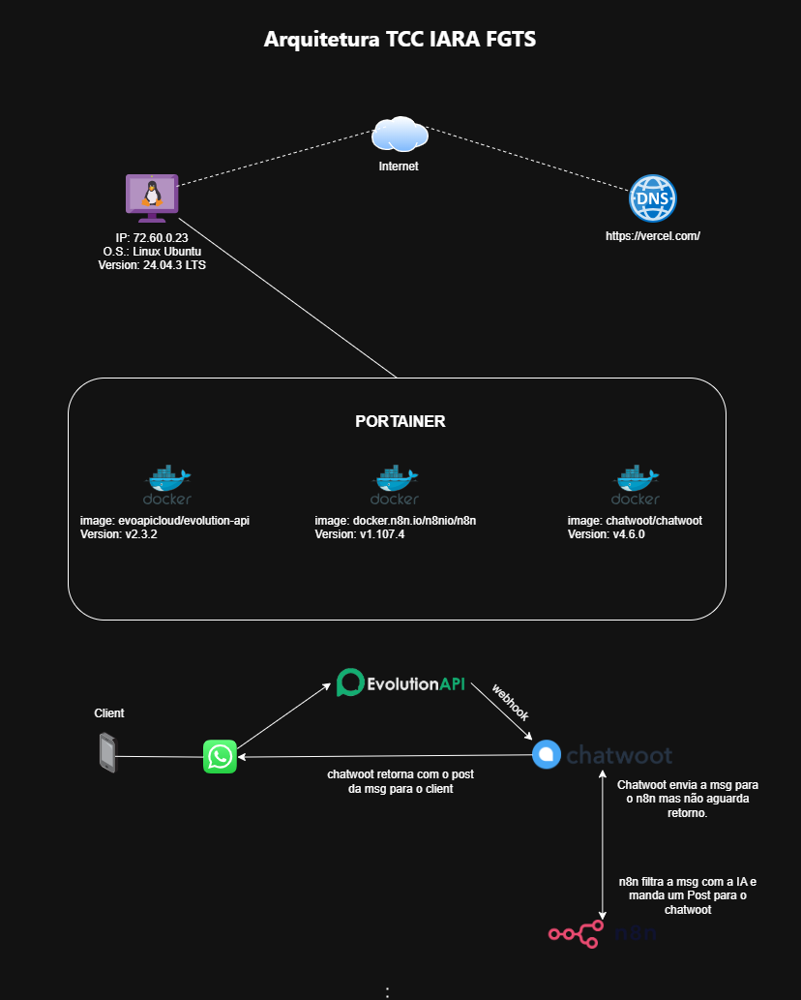

# IARA --- TCC Cleyton

## Aplicação de Inteligência Artificial e Automação de Processos no contexto do FGTS Digital

Este repositório reúne **todo o material de apresentação** do TCC,
incluindo arquitetura, stacks Docker utilizadas, links de acesso aos
serviços e roteiro de demonstração utilizado na defesa.

> ⚠️ **Atenção:** este repositório NÃO é destinado à execução automática
> do sistema. Ele serve para apresentação, documentação e consulta pela
> banca.

------------------------------------------------------------------------

## 📌 Visão Geral da Solução

A solução **IARA** integra automações, inteligência artificial e
serviços externos para simplificar processos relacionados ao **FGTS
Digital**.

### Arquitetura (Diagrama)

------------------------------------------------------------------------

## 📂 Estrutura do Repositório

    tcc-iara/
    ├─ README.md
    ├─ stack/
    │  ├─ docker-compose.n8n.yml
    │  ├─ docker-compose.evolution.yml
    │  └─ docker-compose.chatwoot.yml
    └─ assets/
       └─ diagram.drawio

------------------------------------------------------------------------

## 🧩 Componentes da Solução

### **1. N8N --- Orquestrador de Fluxos**

-   Utilizado para automações, webhooks e integrações com APIs
-   Editor visual acessível via navegador

### **2. Chatwoot --- Atendimento e Chat**

-   Interface utilizada para conversas com usuários
-   Conectado ao bot via webhook → N8N

### **3. Evolution API**

-   Serviço responsável por consultas e verificações externas

### **4. Portainer**

-   Usado para gerenciar os containers Docker e subir as stacks

------------------------------------------------------------------------

## 🔗 Acessos dos Serviços (Ambiente de Demonstração)

### **N8N**

-   **URL:** https://dev.n8n.consigia.com\
-   **Usuário:** vcleytonwinicius@gmail.com\
-   **Senha:** 960DtMWcMfyX

### **Evolution Manager**

-   **URL Manager:** https://dev.evo.consigia.com/manager/\
-   **API Base:** https://dev.evo.consigia.com\
-   **Chave Global:** 429683C4C977415CAAFCCE10F7D57E11

### **Chatwoot**

-   **URL:** https://chat.consigia.com.br/a\
-   **Usuário:** vcleytonwinicius@gmail.com\
-   **Senha:** Cleyton@1332

------------------------------------------------------------------------

## 📱 Contato do Projeto

Para demonstração:\
**WhatsApp Bot:** +55 49 9828‑6960

------------------------------------------------------------------------

## 📜 Licença

MIT License -- consulte o arquivo `LICENSE`.
